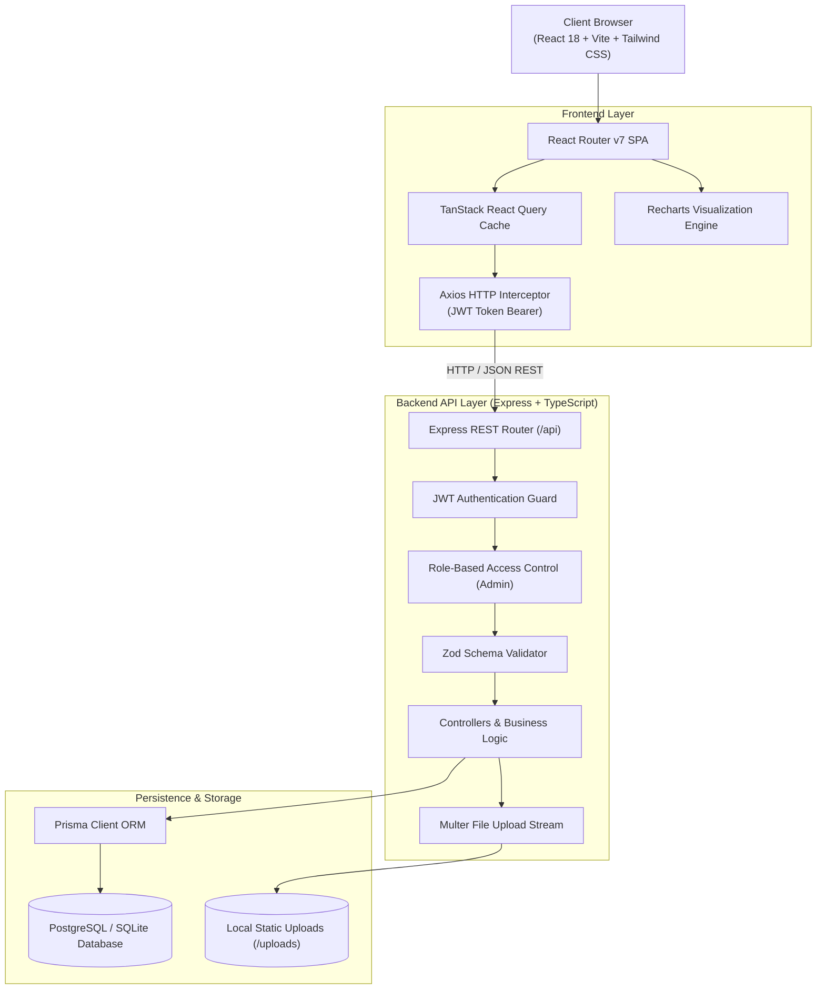

# 🏛️ JobTrack System Architecture

This document describes the high-level architecture, design decisions, and security model of **JobTrack**.

---

## 📐 High-Level Architecture Diagram

---

## 🧩 Architectural Highlights

### 1. Presentation Layer (Frontend)
- **React 18 + Vite**: Lightning-fast hot-module reloading and optimized production chunking.
- **Tailwind CSS**: Micro-tailored dark mode palette, glassmorphism, responsive utilities.
- **TanStack Query (React Query)**: Query caching, optimistic updates, and background refetching.
- **State Management**: Lightweight Context API with persistent `localStorage` synchronization for JWT sessions.
- **Recharts**: Responsive SVG charts for funnel conversion, monthly application throughput, and role breakdowns.

### 2. Service Layer (Backend)
- **Express.js + TypeScript**: Strict type safety end-to-end, modular route controllers, and clean separation of concerns.
- **Zod Schema Validation**: Input validation with descriptive error feedback before requests reach database logic.
- **JWT Authentication**: Secure Bearer tokens with 7-day expiration and automatic account suspension verification on each request.
- **Multer Storage Engine**: Secure file upload handler validating extensions (`.pdf`, `.docx`, `.png`) and disk limits.

### 3. Data & Persistence Layer
- **Prisma ORM**: Declarative schema definition, automated type generation, and relational foreign-key cascades.
- **PostgreSQL / SQLite Multi-Provider**: Seamless SQLite local zero-config testing and production PostgreSQL via Docker or Cloud providers (Neon, Supabase, Render).

---

## 🔒 Security & Authorization Model

| Feature | Mechanism |
|---|---|
| **Password Storage** | Bcrypt with salt rounds (10) |
| **Session Security** | Stateless JSON Web Tokens (JWT) signed with 256-bit secret |
| **HTTP Security Headers** | Helmet.js protection (XSS filter, Clickjacking, MIME type sniff) |
| **CORS** | Strict domain origin whitelisting |
| **Role-Based Access Control** | `requireAdmin` middleware enforcing `role === 'ADMIN'` for moderation routes |
| **Account Suspension** | Real-time status inspection (`ACTIVE` vs `SUSPENDED`) preventing banned access |
