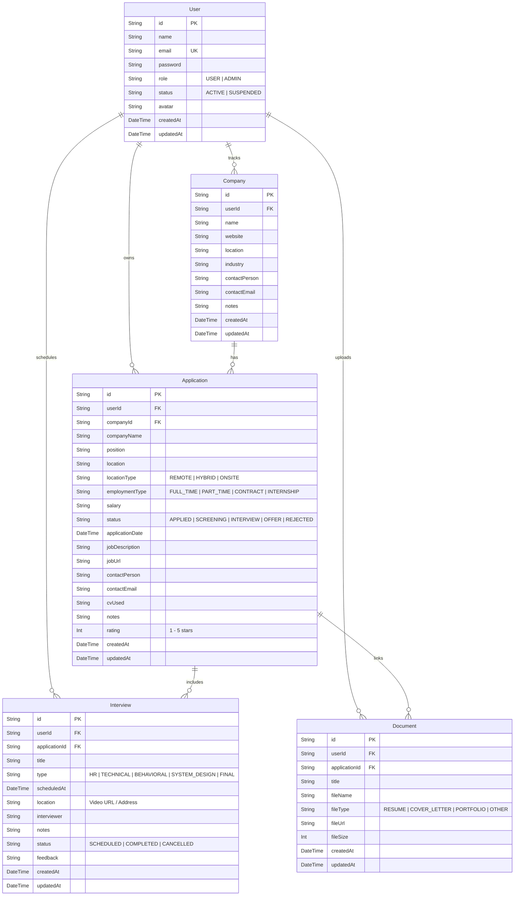

# 🗄️ Database Design & Entity Relationship Diagram

JobTrack uses **Prisma ORM** with **PostgreSQL** in production (and SQLite for instant zero-configuration local development).

---

## 📊 Entity Relationship Diagram (ERD)

---

## ⚡ Database Indexes

- `Application(userId, status)`: Accelerates Kanban column filtering and dashboard pipeline queries.
- `Interview(userId, scheduledAt)`: Optimizes calendar queries and upcoming interview lookups.
- `Company(userId, name)`: Ensures uniqueness of company names per user directory.
- `Document(userId)`: Fast user document retrieval.
